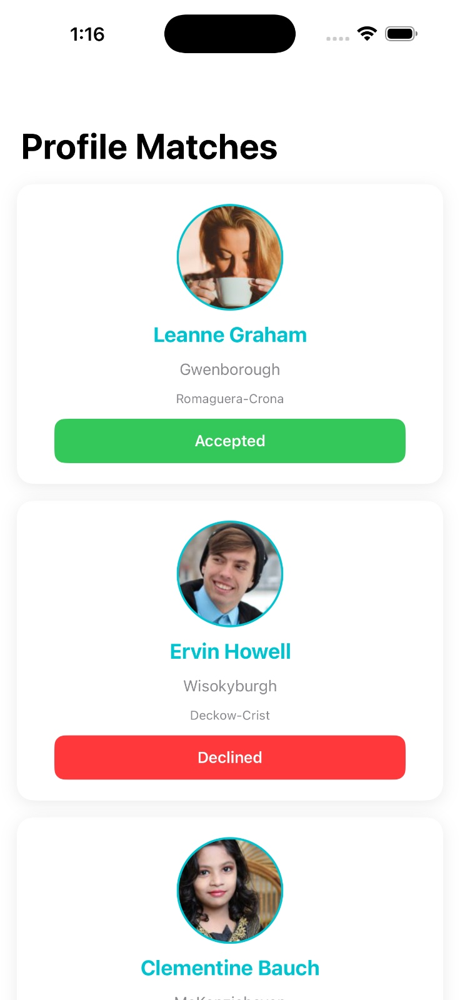
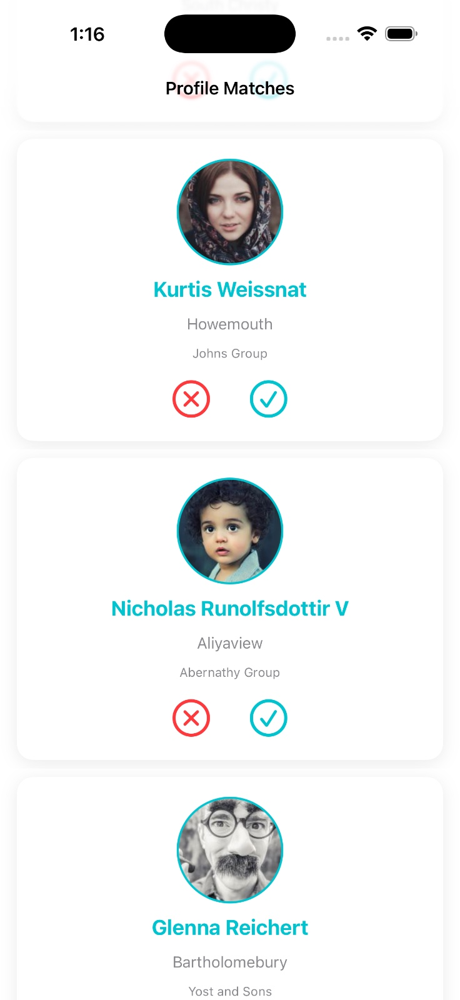

# MatchMate

A SwiftUI matchmaking app that loads user profiles from a remote API, caches them locally with Realm, and supports offline viewing plus accept/decline interactions.

## Features

- List user matches fetched from `jsonplaceholder.typicode.com/users`
- Local caching with Realm for offline access
- Accept / decline buttons for each profile
- Online/offline state detection with `NetworkMonitor`
- Pull-to-refresh to sync when connectivity is available

## Architecture

MatchMate uses a simple MVVM architecture with a repository layer and service abstractions:

- `MatchMateApp.swift`
  - App entry point
  - Launches `MatchListView`
- `Views/`
  - `MatchListView.swift`: displays the list of match cards and handles refresh logic
  - `MatchCardView.swift`: renders each profile row with accept/decline actions
  - `StatusBadgeView.swift`: shows status badges for accepted/declined matches
- `ViewModels/`
  - `MatchListViewModel.swift`: orchestrates loading cached data, syncing with the API, and handling user actions
- `Repository/`
  - `MatchRepository.swift`: reads/writes Realm cache and synchronizes remote API data into local objects
- `Services/`
  - `UserAPIService.swift`: fetches JSON users via `URLSession` and `Combine`
  - `NetworkMonitor.swift`: publishes online/offline connectivity state using Network framework
- `Model/`
  - `MatchUser.swift`: remote API data structure
  - `RealmMatchObject.swift`: local Realm object and persisted match state

### Data flow

1. `MatchListView` creates `MatchListViewModel`
2. ViewModel loads cached matches from `MatchRepository`
3. If online, ViewModel triggers `fetchAndSync()`
4. `MatchRepository` fetches users via `UserAPIService`
5. Fetched users are persisted into Realm, preserving local accept/decline state
6. UI updates automatically via `@Published` properties

## Build / Run Steps

1. Install Xcode 15 or newer
2. Open `MatchMate.xcodeproj` in Xcode
3. Select an iOS simulator or connected device
4. Build and run the `MatchMate` target

> Note: this project uses Realm for local persistence and Combine for reactive data flow.

## Screenshots / Demo

### Screenshots

### Demo Video

<video controls width="100%" preload="metadata">
  <source src="docs/screenshots/video.mp4" type="video/mp4">
  Your browser does not support the video tag.
</video>

## Folder structure

- `MatchMate/` – app source files
- `MatchMate.xcodeproj/` – Xcode project files
- `README.md` – project documentation
- `docs/screenshots/` – screenshot/demo assets

## Notes

- Offline caching is enabled by Realm
- The app only syncs remote data when the network is available
- Local user decisions are preserved when new API data arrives
